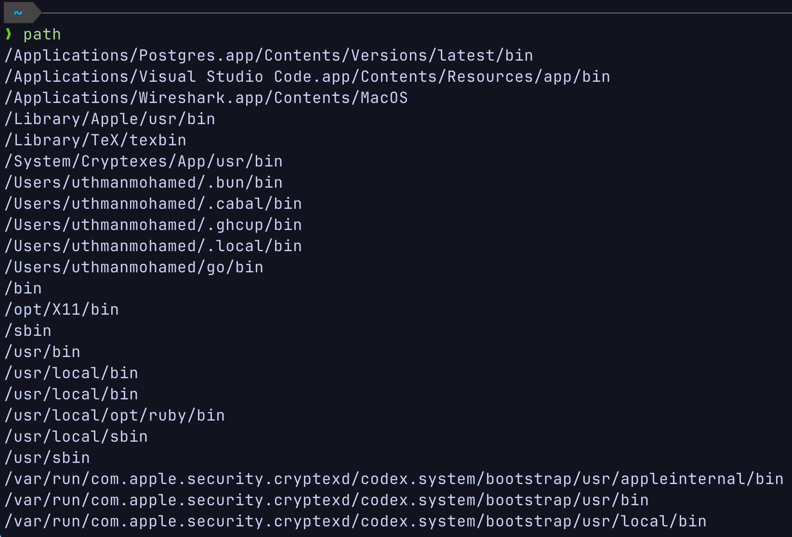

# Path

Simple Go script that makes it easy to view your system `$PATH`, by printing it in a readable format.

## Usage
```bash
path # prints $PATH
path --grep bin # prints $PATH and greps for "bin"
```

## bash
```bash
git clone https://github.com/1239uth/path.git
make # Optionally build the executable with Go
mv path ~/.local/bin # Add script to $PATH
```

## Example

